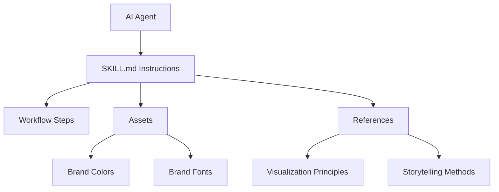

# DataInk

AI Skills for Data Communication and Storytelling

> "The greatest value of a picture is when it forces us to notice what we never expected to see."  
Edward Tufte

DataInk is a collection of modular skills designed to help AI systems produce clear and effective data communication.

Each skill captures established practices from data visualization, information design, and narrative communication. Instead of repeatedly explaining these practices to an AI system, they are packaged into structured `SKILL.md` workflows.

These workflows guide an AI system through chart design, infographic creation, and narrative construction so that every output follows sound communication principles.

Repository:  
https://github.com/oh-da/dataink.git

---

# Why DataInk

Many data visualizations fail not because the data is incorrect but because the communication is weak.

Common problems include:

- pie charts that distort proportions  
- 3D charts that skew values  
- dashboards overloaded with visual noise  
- presentations that show numbers without explaining why they matter  

DataInk addresses these issues by encoding expert workflows into reusable AI skills.

These workflows guide an AI system through the steps required to design charts, construct narratives, and communicate insights clearly.

---

# DataInk Workflow

The skills can be used independently or combined into a full communication workflow.


### Step 1: Data Visualization Expert

Transforms raw data into clear charts.

Examples:

- choose appropriate chart type  
- remove clutter  
- apply visual design principles  

Output: clear charts.

---

### Step 2: Infographic Creator

Combines insights into a visual summary.

Examples:

- infographic layout  
- highlighting key data  
- visual storytelling  

Output: structured infographic.

---

### Step 3: Data Storyteller

Builds a narrative around the visuals.

Examples:

- presentation structure  
- narrative arc  
- decision framing  

Output: presentation or report.

---

# Use Cases

DataInk is useful whenever data must be communicated clearly.

## Business reporting

Examples:

- quarterly performance presentations  
- strategy updates  
- board reports  
- KPI dashboards  

Recommended workflow:

data-visualization → data-storyteller

---

## Dashboard and chart design

Examples:

- redesign cluttered dashboards  
- choose the correct chart type  
- remove visual noise  

Recommended workflow:

data-visualization

---

## Data storytelling and presentations

Examples:

- product analytics presentations  
- marketing performance reviews  
- operations reports  
- research presentations  

Recommended workflow:

data-storyteller

---

## Infographics and visual reports

Examples:

- annual reports  
- research summaries  
- educational visualizations  
- policy reports  

Recommended workflow:

infographic-creator

---

# Design Philosophy

DataInk is built on the idea that data visualization is a communication discipline.

Charts often fail because they prioritize visual decoration instead of clarity and narrative structure. Effective data communication requires understanding the audience, identifying the key insight, and presenting information in a way that guides attention.

The workflows in this repository translate these principles into repeatable steps that an AI system can follow.

## Communication before visualization

Before selecting a chart type, it is important to answer:

- Who is the audience  
- What decision must be made  
- What insight matters most  

For this reason the workflows begin with narrative framing.

---

## Explanatory analysis

Exploratory analysis helps analysts discover insights.

Explanatory analysis communicates those insights to others.

The workflows in this repository focus on explanatory communication by removing unnecessary analysis and highlighting the insights that matter.

---

## Visual simplicity

Effective charts:

- maximize the data ink ratio  
- remove unnecessary visual elements  
- highlight only a small portion of the visual  
- guide the viewer's attention  

---

## Narrative structure

Data becomes persuasive when presented as part of a narrative.

The storytelling workflows follow a simple structure:

1. Setup  
2. Conflict  
3. Resolution  

---

## Modular workflows

Each skill focuses on a specific communication task.

- **data-visualization** helps design charts  
- **infographic-creator** helps build visual summaries  
- **data-storyteller** helps structure narratives  

These skills can be used independently or combined.

---

# Repository Structure

Each skill lives in its own directory with optional `assets` and `references` folders.

```

dataink/
├── infographic-creator/
│   ├── SKILL.md
│   ├── assets/
│   │   ├── brand-colors.md
│   │   └── brand-fonts.md
│   └── references/
│       ├── audience-context.md
│       └── visual-hierarchy.md
├── data-visualization/
│   ├── SKILL.md
│   ├── assets/
│   │   ├── brand-colors.md
│   │   └── brand-fonts.md
│   └── references/
│       ├── medium-selection.md
│       ├── chart-types.md
│       └── design-principles.md
└── data-storyteller/
    ├── SKILL.md
    └── references/
        ├── narrative-arc.md
        ├── flow-and-repetition.md
        └── logic-validation.md

```

---

# Skill Architecture



The AI loads instructions first and consults assets or references only when necessary.

---

# Getting Started

Clone the repository:

```bash
git clone https://github.com/oh-da/dataink.git
```

Point your AI system to a skill:

```
Follow the instructions in dataink/data-visualization/SKILL.md
to visualize the attached dataset.
```

Customize brand assets if needed:

```
assets/brand-colors.md
assets/brand-fonts.md
```

---

# Roadmap

Future additions may include:

### Dashboard Design

- dashboard layout guidelines  
- KPI prioritization  
- interaction design  

### Annotation and Insight Highlighting

- annotation strategies  
- insight callouts  
- explanation patterns  

### Accessibility in Visualization

- color blind safe palettes  
- contrast validation  
- font readability  

### Visualization Review

A skill that critiques charts and suggests improvements.

---

# Contributing

Contributions are welcome.

To add a new skill:

1. Create a directory  
2. Add a `SKILL.md`  
3. Include references if needed  
4. Add assets for brand customization  

---

# License

See the LICENSE file for details.

---

## Acknowledgments and Attribution

This repository adapts concepts, frameworks, and principles from the following authors and works. It is intended as a practical workflow tool, not a substitute for reading the original books — which are highly recommended.

### Cole Nussbaumer Knaflic — *Storytelling with Data* (Wiley, 2015)

The `data-storyteller` and `infographic-creator` skills are substantially adapted from techniques described in this book. Specific frameworks and concepts used include:

- **The "3-Minute Story"** — a planning exercise for distilling the core narrative (Chapter 1)
- **The "Big Idea"** — a single-sentence formulation of the key message, originally from Nancy Duarte's *Resonate* (Wiley, 2010) and presented by Knaflic with three structural criteria (Chapter 1)
- **The Three-Act Narrative Arc** applied to data presentations, with the "setting / main character / imbalance" framing credited by Knaflic to Cliff Atkinson's *Beyond Bullet Points* (Microsoft Press, 2005) (Chapter 7)
- **The tension between "what is" and "what could be"** — a framing attributed by Knaflic to Nancy Duarte's *Resonate* (Chapter 7)
- **"Lead with the Ending"** — a narrative flow strategy for time-constrained audiences (Chapter 8)
- **"Bing, Bang, Bongo"** — a three-pass repetition mnemonic (Chapter 8)
- **"Repeatable Sound Bites"** — attributed by Knaflic to Nancy Duarte (Chapter 8)
- **Horizontal Logic, Vertical Logic, and Reverse Storyboarding** — presentation validation tactics (Chapter 8)
- **The "where are your eyes drawn?" test** — a validation exercise for preattentive attribute effectiveness (Chapter 5)
- **Action titles** — the practice of using insight-driven slide titles rather than topic labels
- **Chart selection guidance** — mapping data relationships to chart types, including specific recommendations against pie charts, 3D graphics, and secondary y-axes (Chapter 2)
- **Application of Gestalt principles** (proximity, similarity, closure, enclosure) to chart design (Chapter 3)
- **Table vs. graph selection** guidance (Chapter 2)

The `data-visualization` skill also draws on several of these design and chart selection principles.

### Edward Tufte — *The Visual Display of Quantitative Information* (Graphics Press, 1983)

The "data-ink ratio" concept — the principle that the share of a graphic's ink devoted to data should be maximized — originates in this work. The related practices of removing chart borders, background fills, and decorative gridlines are applications of this principle.

### Lidwell, Holden, and Butler — *Universal Principles of Design* (Rockport, 2003)

The **10% highlighting guideline** — the recommendation that at most 10% of a visual's surface should be highlighted — originates in this book. It is cited by Knaflic in *Storytelling with Data* and is used throughout this repository's skills.

### Visual Perception Research

The Gestalt principles of visual perception (proximity, similarity, closure, continuity) originate in early 20th-century perceptual psychology research. Their application to data visualization is widely discussed in the field.

**Disclaimer:** This repository adapts and reorganizes concepts from the works listed above into structured AI workflows. All borrowed frameworks are attributed to their originators. The text has been written in the author's own words and is not a reproduction of the original works. For the full depth of these ideas, readers are encouraged to consult the source books directly.
