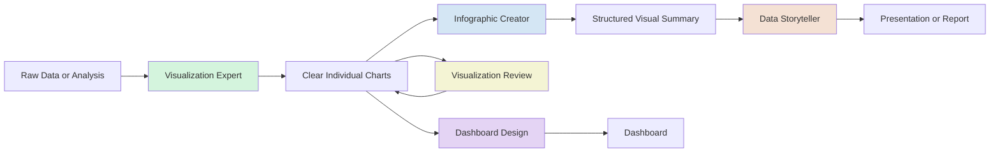
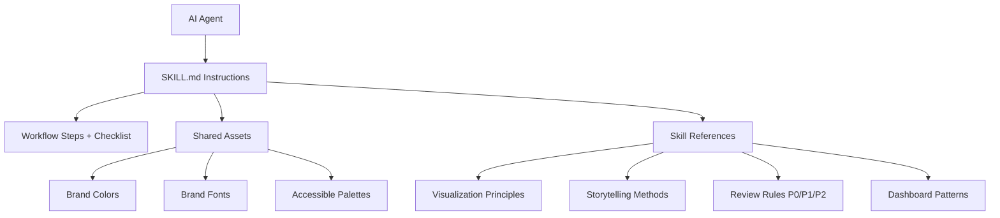

# DataInk

A Claude Code Plugin for Data Communication and Storytelling

> "The greatest value of a picture is when it forces us to notice what we never expected to see."  
Edward Tufte

DataInk is a [Claude Code plugin](https://code.claude.com/docs/en/plugins) containing modular skills for clear, effective data communication.

Each skill captures established practices from data visualization, information design, and narrative communication, packaged into structured `SKILL.md` workflows that guide Claude through chart design, infographic creation, dashboard layout, visualization review, and narrative construction.

Repository:
https://github.com/oh-da/dataink.git

---

# Why DataInk

Many data visualizations fail not because the data is incorrect but because the communication is weak.

Common problems include:

- charts that distort proportions or use low-precision encodings
- 3D charts that skew values
- dashboards overloaded with visual noise
- presentations that show numbers without explaining why they matter
- visualizations that exclude color-blind users or fail accessibility standards

DataInk addresses these issues by encoding expert workflows into reusable AI skills with built-in accessibility checks, structured validation, and prioritized rule enforcement.

---

# DataInk Workflow

The skills can be used independently or combined into a full communication workflow.


```mermaid
flowchart LR

A[Raw Data or Analysis] --> B[Visualization Expert]

B --> C[Clear Individual Charts]

C --> D[Infographic Creator]

D --> E[Structured Visual Summary]

E --> F[Data Storyteller]

F --> G[Presentation or Report]

C --> H[Visualization Review]
H --> C

C --> I[Dashboard Design]
I --> J[Dashboard]

style B fill:#d4f4dd
style D fill:#d4e6f4
style F fill:#f4e1d4
style H fill:#f4f4d4
style I fill:#e4d4f4
```

### Data Visualization Expert

Transforms raw data into clear, accessible charts.

- choose appropriate chart type based on data relationship
- remove clutter and maximize data-ink ratio
- apply brand colors and accessible palettes
- validate with the "eyes drawn" test

Output: clear, accessible charts.

---

### Infographic Creator

Combines insights into a visual summary with narrative structure.

- storyboard with beginning, middle, end
- panel-based layout with consistent design
- brand and accessibility compliance
- context-sensitive data-ink (analytic vs. memorability)

Output: structured infographic.

---

### Data Storyteller

Builds a narrative around the visuals.

- structured context capture (audience, medium, goal)
- three-act narrative arc
- logic validation (horizontal, vertical, reverse storyboard)
- flow strategy (chronological vs. lead with ending)

Output: presentation or report.

---

### Visualization Review (NEW)

Critiques existing visualizations against a prioritized rule system.

- P0: correctness, integrity, accessibility (blocking)
- P1: perception, cognitive load, narrative (strong warnings)
- P2: style, consistency, polish (suggestions)

Output: prioritized report with specific fix recommendations.

---

### Dashboard Design (NEW)

Designs effective dashboard layouts.

- KPI hierarchy and component selection
- attention choreography (what the eye sees first, second, third)
- layout templates (executive summary, operational monitor, comparison)
- 5-second validation test

Output: dashboard layout or code.

---

# Use Cases

DataInk is useful whenever data must be communicated clearly.

## Business reporting

Examples:

- quarterly performance presentations
- strategy updates
- board reports
- KPI dashboards

Recommended workflow:

visualizing-data → storytelling-with-data

---

## Dashboard and chart design

Examples:

- redesign cluttered dashboards
- choose the correct chart type
- remove visual noise
- review existing charts for issues

Recommended workflow:

visualizing-data (or reviewing-visualizations for existing work) → designing-dashboards

---

## Data storytelling and presentations

Examples:

- product analytics presentations
- marketing performance reviews
- operations reports
- research presentations

Recommended workflow:

storytelling-with-data

---

## Infographics and visual reports

Examples:

- annual reports
- research summaries
- educational visualizations
- policy reports

Recommended workflow:

creating-infographics

---

## Visualization audit and improvement

Examples:

- review a team's charts before publishing
- check accessibility compliance
- identify anti-patterns in existing dashboards
- improve chart effectiveness

Recommended workflow:

reviewing-visualizations

---

# Design Philosophy

DataInk is built on the idea that data visualization is a communication discipline.

Charts often fail because they prioritize visual decoration instead of clarity and narrative structure. Effective data communication requires understanding the audience, identifying the key insight, and presenting information in a way that guides attention — accessibly.

The workflows in this repository translate these principles into repeatable steps that an AI system can follow.

## Communication before visualization

Before selecting a chart type, it is important to answer:

- Who is the audience
- What decision must be made
- What insight matters most

For this reason the workflows begin with narrative framing.

---

## Explanatory analysis

Exploratory analysis helps analysts discover insights.

Explanatory analysis communicates those insights to others.

The workflows in this repository focus on explanatory communication by removing unnecessary analysis and highlighting the insights that matter.

---

## Visual simplicity (context-sensitive)

Effective charts:

- maximize the data ink ratio (strictly for analytic charts, with flexibility for public-facing infographics where memorability matters)
- remove unnecessary visual elements
- highlight only a small portion of the visual (10% rule)
- guide the viewer's attention

---

## Accessibility by default

Every visualization should be:

- perceivable without relying on color alone
- meeting WCAG AA contrast requirements
- using CVD-safe color palettes
- including text alternatives for screen readers when appropriate

---

## Narrative structure

Data becomes persuasive when presented as part of a narrative.

The storytelling workflows follow a simple structure:

1. Setup
2. Conflict
3. Resolution

---

## Modular workflows

Each skill focuses on a specific communication task.

- **visualizing-data** helps design charts
- **creating-infographics** helps build visual summaries
- **storytelling-with-data** helps structure narratives
- **reviewing-visualizations** critiques existing work
- **designing-dashboards** helps build dashboard layouts

These skills can be used independently or combined.

---

# Repository Structure

DataInk is structured as a Claude Code plugin. Each skill lives under the `skills/` directory with optional `references` folders. Shared brand assets live at the plugin root.

```
dataink/
├── .claude-plugin/
│   └── plugin.json
├── assets/                          # Shared across all skills
│   ├── brand-colors.md
│   ├── brand-fonts.md
│   └── accessible-palettes.md
└── skills/
    ├── data-visualization/
    │   ├── SKILL.md
    │   └── references/
    │       ├── medium-selection.md
    │       ├── chart-types.md
    │       └── design-principles.md
    ├── data-storyteller/
    │   ├── SKILL.md
    │   └── references/
    │       ├── narrative-arc.md
    │       ├── flow-and-repetition.md
    │       └── logic-validation.md
    ├── infographic-creator/
    │   ├── SKILL.md
    │   └── references/
    │       ├── audience-context.md
    │       └── visual-hierarchy.md
    ├── visualization-review/        # NEW
    │   ├── SKILL.md
    │   └── references/
    │       ├── p0-rules.md
    │       ├── p1-rules.md
    │       └── p2-rules.md
    └── dashboard-design/            # NEW
        ├── SKILL.md
        └── references/
            ├── kpi-components.md
            └── layout-patterns.md
```

---

# Skill Architecture


```mermaid
flowchart TD

A[AI Agent] --> B[SKILL.md Instructions]

B --> C[Workflow Steps + Checklist]
B --> D[Shared Assets]
B --> E[Skill References]

D --> F[Brand Colors]
D --> G[Brand Fonts]
D --> H[Accessible Palettes]

E --> I[Visualization Principles]
E --> J[Storytelling Methods]
E --> K[Review Rules P0/P1/P2]
E --> L[Dashboard Patterns]
```

The AI loads instructions first and consults assets or references only when necessary.

---

# Getting Started

## Install from the marketplace

In Claude Code, run:

```
/plugin marketplace add oh-da/dataink
/plugin install dataink@dataink
```

## Install locally for development

```bash
git clone https://github.com/oh-da/dataink.git
claude --plugin-dir ./dataink
```

## Available skills

Once installed, the following skills are available:

- `/dataink:visualizing-data` — design effective, accessible charts
- `/dataink:storytelling-with-data` — structure data narratives
- `/dataink:creating-infographics` — create visual summaries
- `/dataink:reviewing-visualizations` — critique and improve existing charts
- `/dataink:designing-dashboards` — design dashboard layouts

Claude will also invoke these skills automatically based on task context.

## Customize brand assets

Edit the brand asset files to match your organization:

- `assets/brand-colors.md`
- `assets/brand-fonts.md`

---

# What's New in v3.0.0

## New Skills
- **Visualization Review** — critiques existing visualizations against a prioritized P0/P1/P2 rule system
- **Dashboard Design** — designs dashboard layouts with KPI hierarchy, component selection, and layout templates

## Accessibility by Default
- WCAG AA contrast checks integrated into every skill
- CVD-safe color palettes (Okabe-Ito, Paul Tol, viridis, cividis) as defaults
- Redundant encoding required (never color-only)
- Alt text guidance for web/BI output

## Structural Improvements
- Skills renamed to gerund form per official best practices (`visualizing-data`, `storytelling-with-data`, etc.)
- Brand assets moved to shared `assets/` directory (accessible by all skills)
- Workflow checklists added to every skill for progress tracking
- Feedback loops added to validation steps
- `$ARGUMENTS` support for dynamic skill invocation
- Reference files trimmed — removed content Claude already knows, kept opinionated application rules
- De-duplicated shared content across skills
- Expanded chart selection matrix (dot plots, bullet graphs, slopegraphs, heatmaps, treemaps, choropleths, and more)
- Context-sensitive data-ink ratio (strict for analytic, flexible for memorability)
- Structured context capture (audience, medium, goal, constraints)
- Integrity constraints (uncertainty annotation, metric definitions, no implied causation)

## Breaking Changes
- Skill names changed: `visualize` → `visualizing-data`, `story` → `storytelling-with-data`, `infographic` → `creating-infographics`
- Brand asset paths changed from `skills/data-visualization/assets/` to `assets/`

---

# Contributing

Contributions are welcome.

To add a new skill:

1. Create a directory under `skills/`
2. Add a `SKILL.md` with frontmatter (`name`, `description`)
3. Include references if needed (one level deep from SKILL.md)
4. Reference shared assets from `../../assets/` for brand customization
5. Follow the official [skill authoring best practices](https://platform.claude.com/docs/en/agents-and-tools/agent-skills/best-practices)

---

# License

See the LICENSE file for details.

---

## Acknowledgments and Attribution

This repository adapts concepts, frameworks, and principles from the following authors and works. It is intended as a practical workflow tool, not a substitute for reading the original books — which are highly recommended.

### Cole Nussbaumer Knaflic — *Storytelling with Data* (Wiley, 2015)

The `storytelling-with-data` and `creating-infographics` skills are substantially adapted from techniques described in this book. Specific frameworks and concepts used include:

- **The "3-Minute Story"** — a planning exercise for distilling the core narrative (Chapter 1)
- **The "Big Idea"** — a single-sentence formulation of the key message, originally from Nancy Duarte's *Resonate* (Wiley, 2010) and presented by Knaflic with three structural criteria (Chapter 1)
- **The Three-Act Narrative Arc** applied to data presentations, with the "setting / main character / imbalance" framing credited by Knaflic to Cliff Atkinson's *Beyond Bullet Points* (Microsoft Press, 2005) (Chapter 7)
- **The tension between "what is" and "what could be"** — a framing attributed by Knaflic to Nancy Duarte's *Resonate* (Chapter 7)
- **"Lead with the Ending"** — a narrative flow strategy for time-constrained audiences (Chapter 8)
- **"Bing, Bang, Bongo"** — a three-pass repetition mnemonic (Chapter 8)
- **"Repeatable Sound Bites"** — attributed by Knaflic to Nancy Duarte (Chapter 8)
- **Horizontal Logic, Vertical Logic, and Reverse Storyboarding** — presentation validation tactics (Chapter 8)
- **The "where are your eyes drawn?" test** — a validation exercise for preattentive attribute effectiveness (Chapter 5)
- **Action titles** — the practice of using insight-driven slide titles rather than topic labels
- **Chart selection guidance** — mapping data relationships to chart types, including specific recommendations against pie charts, 3D graphics, and secondary y-axes (Chapter 2)
- **Application of Gestalt principles** (proximity, similarity, closure, enclosure) to chart design (Chapter 3)
- **Table vs. graph selection** guidance (Chapter 2)

The `visualizing-data` skill also draws on several of these design and chart selection principles.

### Stephen Few — *Show Me the Numbers* (Perceptual Edge, 2004)

The seven-category relationship taxonomy used to organize chart selection in the `visualizing-data` skill — time-series, nominal comparison, ranking, part-to-whole, deviation, distribution, and correlation — originates in this work. The color strategy of using muted, natural tones for baseline data and reserving vivid color for emphasis also draws on Few's guidance.

### Edward Tufte — *The Visual Display of Quantitative Information* (Graphics Press, 1983)

The "data-ink ratio" concept — the principle that the share of a graphic's ink devoted to data should be maximized — originates in this work. The related practices of removing chart borders, background fills, and decorative gridlines are applications of this principle.

### Lidwell, Holden, and Butler — *Universal Principles of Design* (Rockport, 2003)

The **10% highlighting guideline** — the recommendation that at most 10% of a visual's surface should be highlighted — originates in this book. It is cited by Knaflic in *Storytelling with Data* and is used throughout this repository's skills.

### Accessibility Standards

WCAG contrast requirements and color accessibility guidance are grounded in W3C Web Content Accessibility Guidelines. CVD-safe palette recommendations draw on the Okabe-Ito palette, Paul Tol's technical notes, and ColorBrewer.

### Visual Perception Research

The Gestalt principles of visual perception (proximity, similarity, closure, continuity) originate in early 20th-century perceptual psychology research. Their application to data visualization is widely discussed in the field.

**Disclaimer:** This repository adapts and reorganizes concepts from the works listed above into structured AI workflows. All borrowed frameworks are attributed to their originators. The text has been written in the author's own words and is not a reproduction of the original works. For the full depth of these ideas, readers are encouraged to consult the source books directly.
