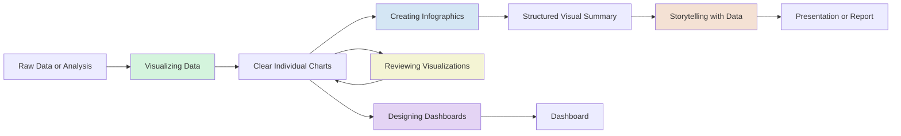
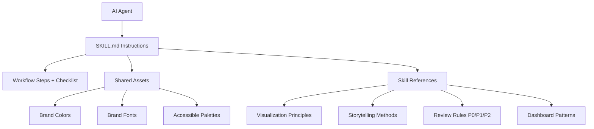

# DataInk

A Claude Code Plugin for Data Communication and Storytelling

> "The greatest value of a picture is when it forces us to notice what we never expected to see."
> — Edward Tufte

DataInk is a [Claude Code plugin](https://code.claude.com/docs/en/plugins) containing modular skills for clear, effective data communication.

Each skill captures established practices from data visualization, information design, and narrative communication, packaged into structured `SKILL.md` workflows that guide Claude through chart design, infographic creation, dashboard layout, visualization review, and narrative construction.

---

## Why DataInk

Many data visualizations fail not because the data is incorrect but because the communication is weak.

Common problems include:

- charts that distort proportions or use low-precision encodings
- 3D charts that skew values
- dashboards overloaded with visual noise
- presentations that show numbers without explaining why they matter
- visualizations that exclude color-blind users or fail accessibility standards

DataInk addresses these issues by encoding expert workflows into reusable AI skills with built-in accessibility checks, structured validation, and prioritized rule enforcement.

---

## Getting Started

### Install from the marketplace

In Claude Code, run:

```
/plugin marketplace add oh-da/dataink
/plugin install dataink@dataink
```

### Install locally for development

```bash
git clone https://github.com/oh-da/dataink.git
claude --plugin-dir ./dataink
```

### Available skills

Once installed, the following skills are available:

| Skill | Command | Purpose |
|-------|---------|---------|
| Visualizing Data | `/dataink:visualizing-data` | Design effective, accessible charts |
| Storytelling with Data | `/dataink:storytelling-with-data` | Structure data narratives |
| Creating Infographics | `/dataink:creating-infographics` | Create visual summaries |
| Reviewing Visualizations | `/dataink:reviewing-visualizations` | Critique and improve existing charts |
| Designing Dashboards | `/dataink:designing-dashboards` | Design dashboard layouts |

Claude will also invoke these skills automatically based on task context.

### Customize brand assets

Edit the brand asset files to match your organization:

- `assets/brand-colors.md` — define your highlight and baseline colors
- `assets/brand-fonts.md` — define your typefaces and size hierarchy

---

## Workflow

The skills can be used independently or combined into a full communication workflow.


```mermaid
flowchart LR

A[Raw Data or Analysis] --> B[Visualizing Data]

B --> C[Clear Individual Charts]

C --> D[Creating Infographics]
D --> E[Structured Visual Summary]

E --> F[Storytelling with Data]
F --> G[Presentation or Report]

C --> H[Reviewing Visualizations]
H --> C

C --> I[Designing Dashboards]
I --> J[Dashboard]

style B fill:#d4f4dd
style D fill:#d4e6f4
style F fill:#f4e1d4
style H fill:#f4f4d4
style I fill:#e4d4f4
```

### Visualizing Data

Transforms raw data into clear, accessible charts.

- Select chart type based on data relationship (7-category taxonomy + extended matrix)
- Remove clutter and maximize data-ink ratio
- Apply brand colors and CVD-safe accessible palettes
- Validate with the "eyes drawn" test
- Check WCAG AA contrast and redundant encoding

### Creating Infographics

Combines insights into a visual summary with narrative structure.

- Storyboard with beginning, middle, end ("3-minute story")
- Panel-based layout with consistent design
- Brand and accessibility compliance
- Context-sensitive data-ink (strict for analytic, flexible for memorability)

### Storytelling with Data

Builds a narrative around the visuals.

- Structured context capture (audience, medium, goal, time available)
- Three-act narrative arc with tension and call to action
- Logic validation (horizontal, vertical, reverse storyboard)
- Flow strategy (chronological vs. lead with ending)

### Reviewing Visualizations

Critiques existing visualizations against a prioritized rule system.

- **P0 (must-fix):** correctness, integrity, accessibility — chart-task mismatch, misleading scales, color-only encoding, contrast failures, missing alt text
- **P1 (strong warning):** perception, cognitive load, narrative — low-precision encodings, overplotting, no clear takeaway, legend dependence
- **P2 (polish):** style, consistency — inconsistent tokens, excess non-data ink, palette misuse

### Designing Dashboards

Designs effective dashboard layouts.

- KPI hierarchy and component selection (tiles, sparklines, bullet graphs, heatmaps)
- Attention choreography (what the eye sees first, second, third)
- Layout templates (executive summary, operational monitor, comparison)
- 5-second validation test

---

## Use Cases

### Business reporting

Quarterly performance, strategy updates, board reports, KPI dashboards.

Recommended: `visualizing-data` → `storytelling-with-data`

### Dashboard and chart design

Redesign cluttered dashboards, choose chart types, remove visual noise, review existing charts.

Recommended: `visualizing-data` → `designing-dashboards` (or `reviewing-visualizations` for existing work)

### Data storytelling and presentations

Product analytics, marketing reviews, operations reports, research presentations.

Recommended: `storytelling-with-data`

### Infographics and visual reports

Annual reports, research summaries, educational visualizations, policy reports.

Recommended: `creating-infographics`

### Visualization audit and improvement

Review charts before publishing, check accessibility compliance, identify anti-patterns.

Recommended: `reviewing-visualizations`

---

## Design Philosophy

DataInk is built on the idea that data visualization is a communication discipline. The workflows translate established principles into repeatable steps that an AI system can follow.

**Communication before visualization** — Before selecting a chart type, answer: who is the audience, what decision must be made, what insight matters most. Workflows begin with narrative framing.

**Explanatory analysis** — Exploratory analysis discovers insights. Explanatory analysis communicates them. These workflows focus on explanatory communication.

**Visual simplicity (context-sensitive)** — Maximize the data-ink ratio for analytic charts. Allow selective embellishment for public-facing infographics where memorability matters. Highlight at most 10% of the visual surface.

**Accessibility by default** — Every visualization should be perceivable without relying on color alone, meeting WCAG AA contrast requirements, using CVD-safe palettes, and including text alternatives when appropriate.

**Narrative structure** — Data becomes persuasive as part of a narrative: setup → conflict → resolution.

**Modular workflows** — Each skill focuses on one communication task. Use independently or combine.

---

## Repository Structure

```
dataink/
├── .claude-plugin/
│   └── plugin.json
├── assets/                          # Shared across all skills
│   ├── brand-colors.md
│   ├── brand-fonts.md
│   └── accessible-palettes.md
└── skills/
    ├── data-visualization/
    │   ├── SKILL.md
    │   └── references/
    │       ├── medium-selection.md
    │       ├── chart-types.md
    │       └── design-principles.md
    ├── data-storyteller/
    │   ├── SKILL.md
    │   └── references/
    │       ├── narrative-arc.md
    │       ├── flow-and-repetition.md
    │       └── logic-validation.md
    ├── infographic-creator/
    │   ├── SKILL.md
    │   └── references/
    │       ├── audience-context.md
    │       └── visual-hierarchy.md
    ├── visualization-review/
    │   ├── SKILL.md
    │   └── references/
    │       ├── p0-rules.md
    │       ├── p1-rules.md
    │       └── p2-rules.md
    └── dashboard-design/
        ├── SKILL.md
        └── references/
            ├── kpi-components.md
            └── layout-patterns.md
```

### Skill Architecture


```mermaid
flowchart TD

A[AI Agent] --> B[SKILL.md Instructions]

B --> C[Workflow Steps + Checklist]
B --> D[Shared Assets]
B --> E[Skill References]

D --> F[Brand Colors]
D --> G[Brand Fonts]
D --> H[Accessible Palettes]

E --> I[Visualization Principles]
E --> J[Storytelling Methods]
E --> K[Review Rules P0/P1/P2]
E --> L[Dashboard Patterns]
```

The AI loads instructions first and consults assets or references only when necessary (progressive disclosure).

---

## Version History

| Version | Date | What Changed |
|---------|------|--------------|
| **v3.0.0** | 2026-04-04 | 5 skills (added Visualization Review and Dashboard Design). Accessibility by default (WCAG AA, CVD-safe palettes, redundant encoding, alt text). Best practices alignment (gerund naming, checklists, feedback loops, `$ARGUMENTS`, trimmed references). Expanded chart matrix (+8 types). Context-sensitive data-ink. Structured context capture. Integrity constraints. Shared brand assets. |
| **v2.0.0** | 2026-03-08 | Converted to Claude Code plugin. Added marketplace distribution, auto-invocation, and shorter skill commands. |
| **v1.0.0** | 2026-03-06 | Initial release with 3 skills: Data Visualization Expert, Data Storyteller, Infographic Creator. Workflows grounded in Tufte, Few, Knaflic, and Gestalt principles. |

---

## Contributing

Contributions are welcome.

To add a new skill:

1. Create a directory under `skills/`
2. Add a `SKILL.md` with frontmatter (`name`, `description`)
3. Include references if needed (one level deep from SKILL.md)
4. Reference shared assets from `../../assets/` for brand customization
5. Follow the official [skill authoring best practices](https://platform.claude.com/docs/en/agents-and-tools/agent-skills/best-practices)

---

## License

See the LICENSE file for details.

---

## Acknowledgments and Attribution

This repository adapts concepts, frameworks, and principles from the following authors and works. It is intended as a practical workflow tool, not a substitute for reading the original books — which are highly recommended.

### Cole Nussbaumer Knaflic — *Storytelling with Data* (Wiley, 2015)

The `storytelling-with-data` and `creating-infographics` skills are substantially adapted from techniques described in this book. Specific frameworks and concepts used include:

- **The "3-Minute Story"** — a planning exercise for distilling the core narrative (Chapter 1)
- **The "Big Idea"** — a single-sentence formulation of the key message, originally from Nancy Duarte's *Resonate* (Wiley, 2010) and presented by Knaflic with three structural criteria (Chapter 1)
- **The Three-Act Narrative Arc** applied to data presentations, with the "setting / main character / imbalance" framing credited by Knaflic to Cliff Atkinson's *Beyond Bullet Points* (Microsoft Press, 2005) (Chapter 7)
- **The tension between "what is" and "what could be"** — a framing attributed by Knaflic to Nancy Duarte's *Resonate* (Chapter 7)
- **"Lead with the Ending"** — a narrative flow strategy for time-constrained audiences (Chapter 8)
- **"Bing, Bang, Bongo"** — a three-pass repetition mnemonic (Chapter 8)
- **"Repeatable Sound Bites"** — attributed by Knaflic to Nancy Duarte (Chapter 8)
- **Horizontal Logic, Vertical Logic, and Reverse Storyboarding** — presentation validation tactics (Chapter 8)
- **The "where are your eyes drawn?" test** — a validation exercise for preattentive attribute effectiveness (Chapter 5)
- **Action titles** — the practice of using insight-driven slide titles rather than topic labels
- **Chart selection guidance** — mapping data relationships to chart types, including specific recommendations against pie charts, 3D graphics, and secondary y-axes (Chapter 2)
- **Application of Gestalt principles** (proximity, similarity, closure, enclosure) to chart design (Chapter 3)
- **Table vs. graph selection** guidance (Chapter 2)

The `visualizing-data` skill also draws on several of these design and chart selection principles.

### Stephen Few — *Show Me the Numbers* (Perceptual Edge, 2004)

The seven-category relationship taxonomy used to organize chart selection in the `visualizing-data` skill — time-series, nominal comparison, ranking, part-to-whole, deviation, distribution, and correlation — originates in this work. The color strategy of using muted, natural tones for baseline data and reserving vivid color for emphasis also draws on Few's guidance.

### Edward Tufte — *The Visual Display of Quantitative Information* (Graphics Press, 1983)

The "data-ink ratio" concept — the principle that the share of a graphic's ink devoted to data should be maximized — originates in this work. The related practices of removing chart borders, background fills, and decorative gridlines are applications of this principle.

### Lidwell, Holden, and Butler — *Universal Principles of Design* (Rockport, 2003)

The **10% highlighting guideline** — the recommendation that at most 10% of a visual's surface should be highlighted — originates in this book. It is cited by Knaflic in *Storytelling with Data* and is used throughout this repository's skills.

### Accessibility Standards

WCAG contrast requirements and color accessibility guidance are grounded in W3C Web Content Accessibility Guidelines. CVD-safe palette recommendations draw on the Okabe-Ito palette, Paul Tol's technical notes, and ColorBrewer.

### Visual Perception Research

The Gestalt principles of visual perception (proximity, similarity, closure, continuity) originate in early 20th-century perceptual psychology research. Their application to data visualization is widely discussed in the field.

**Disclaimer:** This repository adapts and reorganizes concepts from the works listed above into structured AI workflows. All borrowed frameworks are attributed to their originators. The text has been written in the author's own words and is not a reproduction of the original works. For the full depth of these ideas, readers are encouraged to consult the source books directly.
